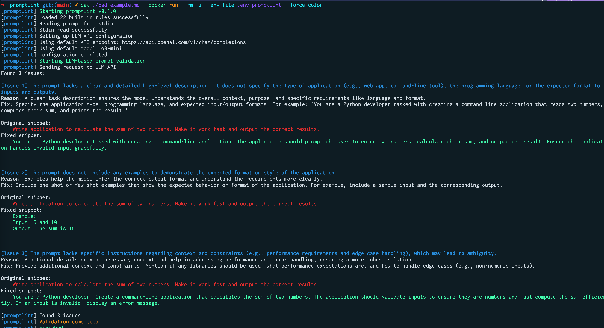

# PromptLint

> **Warning**
> This is a joke. It shouldn't be taken seriously.

CLI utility for validating LLM prompts with exclusive use of LLM API to check compliance with best practices.



## Installation

```bash
# Install via Go
go install github.com/username/promptlint@latest

# Or download a pre-built binary from Releases
# https://github.com/username/promptlint/releases
```

## Usage

```bash
# Check a prompt from a file
./promptlint -file=your-prompt.txt

# Check a prompt from stdin
cat your-prompt.txt | ./promptlint

# Check version
./promptlint -version

# Force colored output
./promptlint -file=your-prompt.txt --force-color

# Disable colored output
./promptlint -file=your-prompt.txt --no-color
```

## Environment Variables

| Variable | Description | Default |
|------------|----------|------------|
| `PROMPTLINT_API_KEY` | API key for LLM (required) | - |
| `PROMPTLINT_API_ENDPOINT` | URL of API endpoint | https://api.openai.com/v1/chat/completions |
| `PROMPTLINT_MODEL_NAME` | LLM model name | o3-mini |
| `NO_COLOR` | Disable colorized output | - |

## Docker Usage

You can also run PromptLint using Docker:

```bash
# Build the Docker image
docker build -t promptlint .

# Run with a prompt file (mounting the current directory)
docker run --rm -v $(pwd):/data -e PROMPTLINT_API_KEY=your_api_key promptlint -file=/data/your-prompt.txt

# Run with stdin
cat your-prompt.txt | docker run --rm -i -e PROMPTLINT_API_KEY=your_api_key promptlint
```

### Using GitHub Container Registry

```bash
# Pull the latest version
docker pull ghcr.io/username/promptlint:latest

# Run with your API key
docker run --rm -v $(pwd):/data -e PROMPTLINT_API_KEY=your_api_key ghcr.io/username/promptlint:latest -file=/data/your-prompt.txt
```

## Features

- Deep validation of prompts through LLM API
- Customizable checking rules (embedded YAML)
- Clear error output with explanations and recommendations
- Colorized terminal output with control options
- Progress reporting during execution
- Compact binary without external dependencies
- Docker container support
- CI/CD integration with GitHub Actions

## How It Works

The tool follows a simple pipeline architecture:

```
Input → LLM API → Reporter → Output
```

1. **Input Processing**:
   - Reads prompt text from a file (using the `-file` flag) or from stdin
   - Correctly handles stdin (distinguishes between direct terminal input and redirections)

2. **Prompt Checking**:
   - Validates prompts using external LLM API based on rules defined in YAML
   - Rules are embedded in the binary at compile time
   - Uses structured response format with tools for reliable results

3. **Reporting**:
   - Formats all issues found during validation
   - Outputs a clean, colorized report to stdout
   - Shows "No issues found!" when the prompt passes all checks

## Contribution

We welcome community contributions! If you have ideas for improvements or you've found bugs, please create an issue or submit a pull request.

## License

[MIT](LICENSE)

## Implementation Language

I recommend using the Go language. Go allows you to compile the program into a single statically linked binary file, which can be distributed without requiring users to install additional dependencies. In addition, the built-in cross-compilation capabilities make it an excellent choice for CI/CD, simplifying the automation of building, testing, and deployment.


